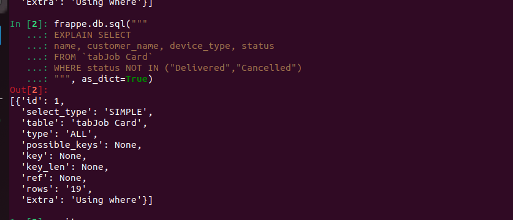
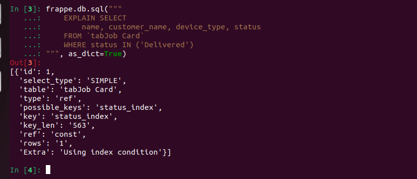

### Quickfix

Assessment purpose

### Installation

You can install this app using the [bench](https://github.com/frappe/bench) CLI:

```bash
cd $PATH_TO_YOUR_BENCH
bench get-app $URL_OF_THIS_REPO --branch develop
bench install-app quickfix
```

### Contributing

This app uses `pre-commit` for code formatting and linting. Please [install pre-commit](https://pre-commit.com/#installation) and enable it for this repository:

```bash
cd apps/quickfix
pre-commit install
```

Pre-commit is configured to use the following tools for checking and formatting your code:

- ruff
- eslint
- prettier
- pyupgrade

### CI

This app can use GitHub Actions for CI. The following workflows are configured:

- CI: Installs this app and runs unit tests on every push to `develop` branch.
- Linters: Runs [Frappe Semgrep Rules](https://github.com/frappe/semgrep-rules) and [pip-audit](https://pypi.org/project/pip-audit/) on every pull request.


### License

mit
# quickfix

common_site config file : the file is shared accross all the sites in the bench 
                          access the entire database host ,redis port etc

site_config file : the file is used to store configuration specifically for one site such as database name and database password etc

if a secret(password or api key) is accidently put in a common_site_config file ,since it is common to all sites in the bench, it becomes accessible to all sites in the bench ,this  may expose the secrets of the development site to other site

the bench start launches the following four processes:
1) Web
2)  worker
3)  Scheduler
4) Socket io 
WEB: handles the normal browser requests ,
      when an user opens the form ,saves form ,logins,api calls the web process handles it
WORKER: some tasks are heavy and slows down the ui ,so background jobs are introduced to make the heavy tasks run in background
        the queues seprates the jobs and assigns to the the workers to complete those tasks
Scheduler: it is a time of background job that is trigerred based on the time basis
Socket io: client browser communication that provides realtime notifications

When a browser hits /api/method/quickfix.api.get_job_summary - what Python
function handles this request and how does Frappe find it?
When a browser hits /api/method/quickfix.api.get_job_summary the frappe whitelist handles the custom api calls and executes the function
How does the frappe knows
when  a client makes a server requests through api method the function first looks into the app.py,so that app.py recieves the request and passes to the function execute_cmd in handler.py which then calls the frappe.get_attr() , the get_attr() from init.py is used to call the whitelisted python function and the function returns a json file
consider the scenario if we have a wrong function name provided then there shows up a traceback error from the handler.py 


When a browser hits /api/resource/Job Card/JC-2024-0001 - what happens
differently compared to /api/method/?
when  /api/method/ is called it uses the custom whitelisted python function that is written by developer 
but when a browser hits /api/resource/Job Card/JC-2024-0001 the rest api call is being processed that is there is no need of the custom functions ,it directly access the database ,fetches or modifies the database without the python custom function ,the rest api controlers directly access the job card doctype and the document jc-2024-000021 and returns the json data


When a browser hits /track-job - which file/function handles it and why?
when the browser hits the track-job ,app.py recieves the request ,then the request is sent to the handler.py ,so that the handler.py identifies the type of the request whether it is rest api call or the custom method then it extracts the method path and loads the execute_cmd in the handler.py file ,thenn the request is sent to the init.py to load the frappe.get_attr() function then the whitelist function is checked and the function is executed and the response is sent throught the json file

Open your Frappe site in browser devtools. Find the X-Frappe-CSRF-Token in a POST request. Where does this value come from and what would happen if you
omitted it?
After opening the frappe site in browser devtools ,while creating a new record or while saving the record the post request is made ,this post request value is a randomly generated value to store in the session id and we can encounter the csrf token under the request headers or in the bench console if we give frapp.csrf_token we can get the token .If the token is omitted the put post method doesnt havet he session id and it will not work ,if tokens are missing frappe will bolck the request for the security reasons

In bench console, run: import frappe; frappe.session.data and describe what it contains
frappe.session.data returns the null dictionary while the frappe.session returns the sid ,data and the user

With developer_mode: 1 - trigger a Python exception in one of your whitelisted methods. What does the browser receive?
returned a undefined variable in the python whitelisted function and the browser recived the nameerror
  File "apps/quickfix/quickfix/api.py", line 6, in execute
    return x
NameError: name 'x' is not defined

Set developer_mode: 0 - repeat. What does the browser receive now? Why is this
important for production?
here since we are running in local development when the developer mode is either 0 or 1 the error full be shown fully with the traceback
but when in the production mode ,when the developer mode is 0 the error will be shown as internal server error and not the full traceback will be shown 
this is important for production because while showing the detailled error this may expose the detailled code structure and information 

Where do production errors go if they are hidden from the browser?
the production errors which are hidden from browser are stored in log file 
the bench contains a folder log with frappe.log


In a whitelisted method, call frappe.get_doc("Job Card", name) WITHOUT ignore_permissions. Then log in as a QF Technician user who is NOT assigned to that job. What error is raised and at what layer does Frappe stop the request?
while logginned as the qf technician where user not assigned to the job i didnt get any permission error ,because there is no check permission code 
instead i got the name field becuase the user has the select permission and this select permission is used here
self.init_valid_columns() this function is called from the document.py and the function redirects to the def init_valid_columns(self) function in the base_document.py instead of the permission check it directly validates the column in the table schema and returns the valid column with the select permissions 

Run: frappe.db.sql("SHOW TABLES LIKE '%Job%'") and list what you see. Explain the tab prefix convention.
 this is the output i see (('tabJob card',), ('tabScheduled Job Log',), ('tabScheduled Job Type',))
 when ever u create the tables in the doctype ,frappe automatically adds the tab prefix,this tab prefix easy helpful for the easy identification of the doctype table

 Run: frappe.db.sql("DESCRIBE `tabJob card`", as_dict=True) and list 5 column names you recognise from your DocType fields.
 i saw the database columns created for the Job card doctype the columns names include title,name,owner,creation,and modified

 What are the three numeric values of docstatus and what state does each represent?
docstatus 0 : draft
docstatus 1:  submitted
docstatus 2 : cancelled

Can you call doc.save() on a submitted document? What about doc.submit() on a
cancelled one? Test in bench console and explain why.
the sumitted document contains the docstatus 1 which cannot be change so that doc.save() cant be called ,only when we cancel a submitted doctype or edit a submittable doctype through the allow on submit option the doc.save will be called .No a cancelled document cant be submitted again because the docstatus of the cancelled document becomes 2 and cant be changed ,the one way to submit the cancelled document  is to amend the document and the document can be submitted again

Why would you see a "Document has been modified after you have opened it" error and how does Frappe prevent concurrent overwrites?
the error occurs 
when user A loginned in ,and make changes and user B logins in make changes the error is showed that the document is modified ,frappe prevent concurrent overwrites by checking the doc modified and the db modified if not equal throws an error 

The following snippet has TWO bugs related to document lifecycle. Identify both and write
the corrected version:
def validate(self):
self.total = sum(r.amount for r in self.items)
self.save()
other = frappe.get_doc("Spare Part", self.part)
other.stock_qty -= self.qty
other.save()

def validate(self):
self.total= sum(r.amount for r in self.items)
validate is executed during the doc.save() 
if self._action == "save":
self.run_method("validate"),
again calling the self.save triggers the validate again which then leads to a infinite recursiom  

def on_submit(self):
other = frappe.get_doc("Spare Part", self.part)
other.stock_qty -= self.qty
other.save()
the quantity should be reduced so can be put inside the on submit hook ,so that this action happens during the submit because validate function can run again and again and the stocl quantity will be updated again again

When you append a row to Job Card.parts_used and save, what 4 columns does Frappe automatically set on the child table row?
whwen we append a child table row to the parent docytpe ,frappe automatically sets four columns including parent(wh0) ,parenttype(which doctype),parentfield(which table),index(which row) to link the child row with the parent doctype

What is the DB table name for the Part Usage Entry DocType?
tabPart Usage Entry

If you delete row at idx=2 and re-save, what happens to idx values of remaining rows?
when a row created and the idx =2 is deleted frappe automatically reorders the index and assigns the index accordingly ,this ensures that the indexing is ordered sequentially ,this is done when the doc,save is being executed .i created a Job Card with multiple child rows, deleted the row with idx = 2, saved the document, and verified the idx values using bench console and SQL query.

Rename one of your test Technician records using the Rename Document feature. Then check: does the assigned_technician field on linked Job Cards automatically update? Why or why not? What does "track changes" mean in this context?
i created the test technician and renamed it through the rename document feature ,then while looking in to the assigned_technician filed the renamed value got automatically updated ,because it is a link field and frappe updates all the link fields during the rename .track changes means frappe records field modifications in the version table and shows them in the timeline, allowing us to see old and new values.

Assume the Frappe core updates Job Card's validate() to add a new check. If you
override_doctype_class and forget to update super() - what breaks? Write a test that catches this.
if we forget to update super() the core validations made will not work and only the overrided function will work 
a test that catches this is that in validate i have written code so that if customer name is empty the document will not be saved and in the override doctype classs i have wrote the validation that checks the phone number validity ,if super doesnt exist allows the null customer name if super exits it doesnt allow null customer name

Register TWO validate handlers on Job Card - one in your main controller and one in doc_events. in what order do they run? What happens if both raise a frappe.ValidationError?
the main controller runs first and then the controller in the doc events runs then ,when both raise a frappe.validation error 
the first executed controller method rises an exception ,execution stops immediately and the hooks doesnt even execute

what happens when you register "*" AND a specific DocType handler for the same event? Do both run?
for the same event the specific doctype controller and the wildcard controller also works ,frappe first calls the specific doctype controller and then calls the wildcard controller

what is the difference? When would you use each?
app_include_js is used to use the javascript into the frappe desk for logged  backend users.web_include_js is used to use the javascript into public website or portal pages they serve different environments and should be used depending on whether the customization is for internal users/desk or external users/website .

doctype_js for Job Card is used only when a specific dictype form is used, doctype_list_js for Job Card is used for the particular list view of the specific doctype
doctype_tree_js is not applicable here becuase it used for the doctype that uses the hierarchial structure ,which is used to display the tree doctype,here job card is a normal doctype so doctype_tree_js is not applicable

explain what bench build --app quickfix does and why assets need cache-busting after JS changes
for a specific application the bench build command compiles all the js and css assets files for the production,it makes sure that the latest updates are used 
after the js changes the cache the assests need cache busting because it makes the web users to load the new updated js files instead of using the old js files that is stored in the local cache

Explain: what is the difference between a Jinja context available in Print Formats vs one available in Web Pages? Are they the same?
jinja context available in the print formats recieves the document context while the web pages receives the website requests,the print format already knows which document which is printing while the web pages shows the data which we ask for,no they are not same

What is the _qf_patched guard for in frappe.What breaks without it?
the patch runs only once at the runtime and the qf patched helps to ensure that the patch is executed only once and preventing the recurssion and the duplication issues

Why is isolating patches in monkey_patches.py better than scattering them in __init__.py?
the init.py file runs automatically when we import it ,so if you put monkey patch code in init_.py, it runs automatically.
During dev mode the code reloads init.py runs again,patch runs again makes the recurssion problem

What is the correct escalation path: try doc_events first - then override_doctype_class - then override_whitelisted_methods - then monkey patch. Why is this the order?
 first we try doc_events because it is the safest and least complex point. If that is insufficient, they can move to override_doctype_class, then override_whitelisted_methods, and finally monkey patching as a last option. Each step increases power, system impact, and risk.

 H1 
Making a frappe.call inside the validate client event (before_save handler) - explain why this does not work
Using onload or refresh for async data fetches
making a frappe.call inside client-side validate does not work properly because frappe.call is asynchronous and does not block execution.the form may save before the server response runs making the validation too late
async calls are safe inside onload or refresh because those events are used for UI updates and do not control the document save lifecycle.

H3
describe what a Tree DocType is (example: Account,Employee hierarchy). What is doctype_tree_js used for and what extra fields does a tree DocType require (parent_field, is_group)?
tree doctype is used to store hirearchial data where the one record is the parent and the other record is the child 
doctype_tree_js is a javascript file that ensures how ui works for the tree doctype
A tree doctype needs special fields to maintain hierarchy.the parent_field stores the parent record.the is_group field determines whether a node can have children

H4
explain the tradeoffs - when would a consultant use Client Script DocType vs an app developer use shipped JS? What are the risks of Client Script DocType in production?
client script doctype is used by consultants for quick, site-specific UI customizations because it is stored in the database and does not require deployment.app developers prefer shipped js files because they are stored in the app code with version control, making them safer, maintainable, and consistent for production environments.

Demonstrate the hiding fields vs permission security pitfall: add a JS field hide that hides customer_phone for non-managers - then show that an API call can still retrieve the field. Explain why hiding in JS is not a security measure.
while writig the js script to hide the phone number hides the number only in ui but can be accessed through the postman because the db stores the value,so it is not secure in hiding in js,if wanted to hide we can use role permissions and even when postman call happens the phone number column will be hided

I1
Demonstrate and explain the issues and solutions with respect to f-string SQL and the parameterized pattern.
using f string makes the user input to inject into the sql query while the parameterized pattern passes the value separately and the database treats it as a seperate data

Add a EXPLAIN statement in bench console for your query - screenshot the result and identify if an index is being used on the status column .Add a proper index on Job Card.status by modifying the DocType JSON to include search_index: 1 on the status field
Before editing the json file,after adding search index 

  I4
explain when you would use a Prepared Report vs a real-time Script Report. What are the staleness tradeoffs?
Prepare report is used for the large dataeset such that the report runs in the background and the filters can be applied easily but the new changes in the report are not being updates,while the script slows down the process and not suitable for larger reports but automatically updates the value in the report

Describe the caching risk: if underlying data changes between report preparations, what does the user see?
while the data changes between the report preparation the report will still show the old cached data from the last preparation

  I5
   when is Report Builder appropriate? When must you use Script Report? Describe a scenario where using Report Builder production would be a mistake.
   report builder is required when we want to use for simple reports based and basic filtering purposes ,script report should be preferred when there is a custom logic ,dynamin link and joining of the table when the report builder cant handle 
   consider a scenario to calculate the technician performance that calculates the total job ,average working hour and amount calculated which requires a aggregrate function which is difficult to handle using the report builder
   
   j1
   Putting a frappe.get_all() call inside the Jinja template directly Pre-compute in before_print() and attach to self, then reference in template as doc.precomputed_field.
   avoid calling frappe.get_all() directly in Jinja templates,instead required data should be pre-computed in the controller using before_print() and attached to the document object. The template then accesses it using doc.precomputed_field, improving performance and maintaining separation of logic and presentation.
   
   j2
   In README_internals.md: explain the difference between "raw printing" (sending ESC/POS commands to a thermal printer) and Frappe's HTML-PDF rendering via WeasyPrint
   Raw printing sends direct ESC/POS commands to a thermal printer, so it prints text quickly but supports only simple formatting. Frappe Framework printing uses HTML templates converted to PDF by WeasyPrint, which allows styled layouts but is slower.
   List 3 CSS properties that work in a browser but fail in WeasyPrint
   display: flex, display: grid, and position: fixed.
   Use format_value() for every numeric field in the template - demonstrate what happens without it vs with it for a currency field
   without format value the raw text is visible while using the format value u can see the formatted currency value

   K1
   Explain the 3 queue names (default, long, short) and when to use each
   short is used to complete the quick task,default is used for the normal background jobs while the long is used for the heavy and time consuming tasks

   Explain retry behavior: how many times does Frappe retry a failed background job by default?
  it stores the failed job in the error log and no count specifically

   K2
   how do you disable the scheduler for a specific site? Why would you do this on a dev site?
   we can disable the scheduler using the bench --site sitename disable-scheduler command ,we did this on a developer site to avoid the automatic background jobs during the testing of the site
   Explain: what happens to scheduled jobs that were queued while the worker was down - do they run when the worker comes back up?
   if the worker process is slow or down the job remains in the queue and it is not executed once when the worker starts again it reads the pending jobs and executes it automatically

   K3
   N+1 query detection and fix:
   instaed of the usage of get doc ,here in the code we are trying to take up only two fields,but the get doc fetches the entire document so instead of using get doc we can use get value
   